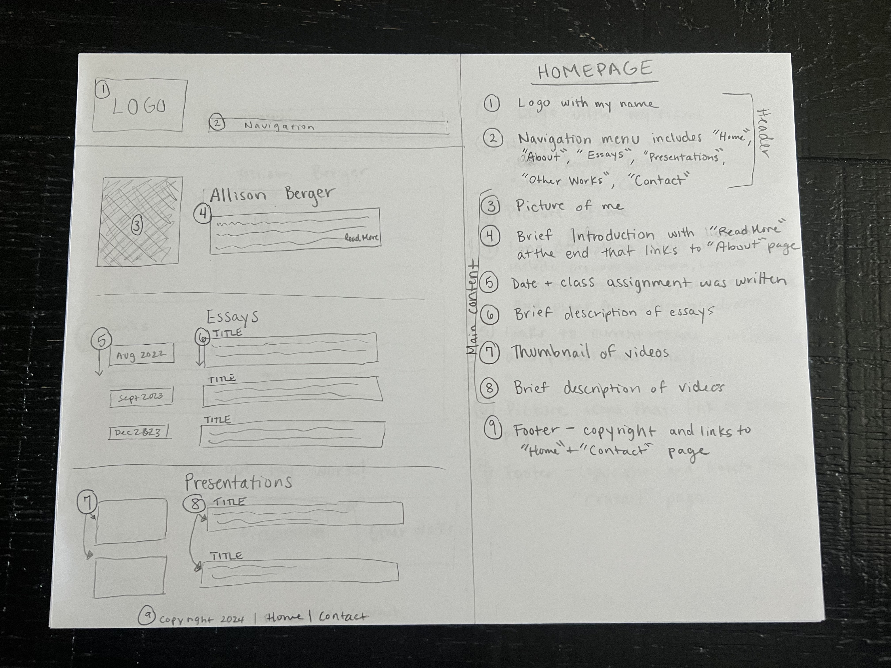
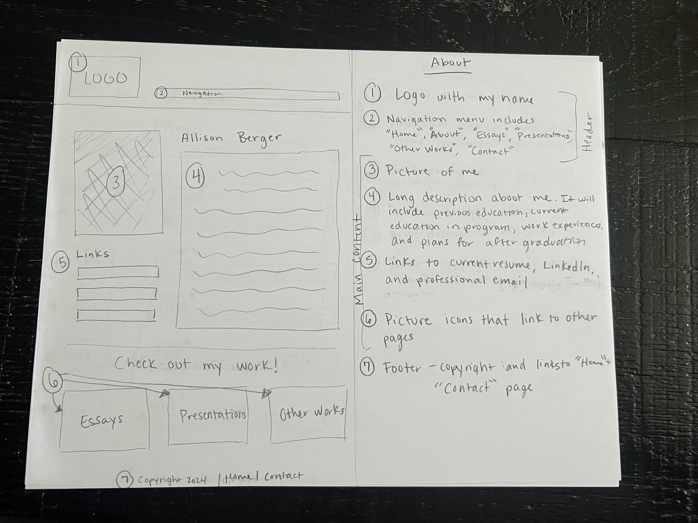
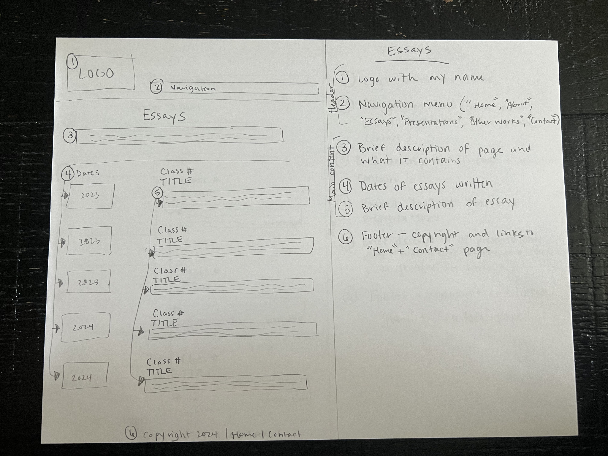
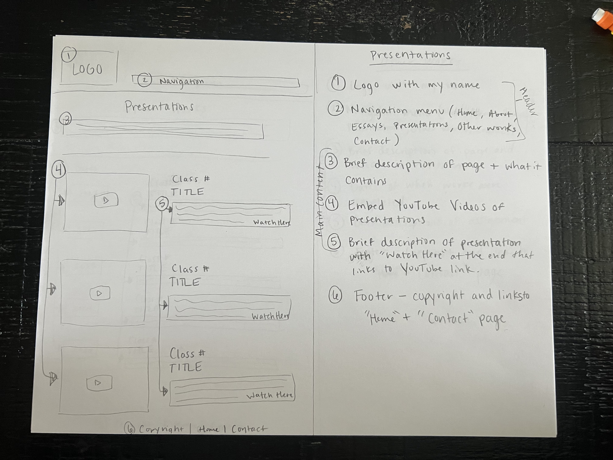
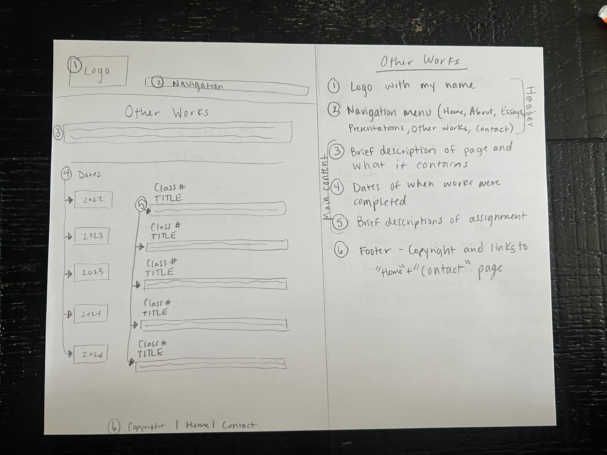
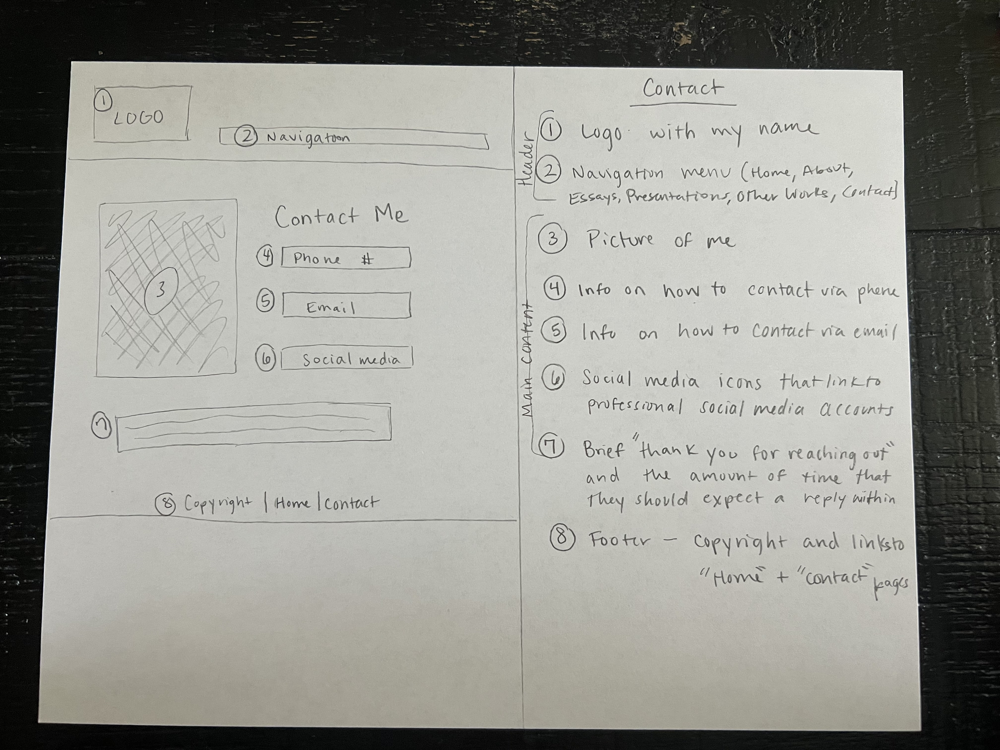

# Allison Berger's INF6420 Project

A portfolio site that will showcase the work that I have completed throughout my time in the MLIS program at Wayne State University.

## Wireframes

Here are some wireframes that show my current plans for this site's architecture and layout.

**Header** - will include a logo with my name in it and the navigation menu.

**Navigation Menu** - will include links to other pages, specifically including *Home, About, Essays, Presentations, Other Works,* and *Contact.*

**Main Content** - will include a brief introduction and a picture of me, followed by a sneak peek at the essays and presentations. The essays section will have the date that the essay was written on the left side of the page and information about the essay on the right side of the page. The presentations section will have a thumbnail picture of the video presentation on the left side of the page and information about the presentation on the right side of the page.

**Footer** - will include copyright information and links to the *Home* and *Contact* pages.

**Header** - will include a logo with my name in it and the navigation menu.

**Navigation Menu** - will include links to other pages, specifically including *Home, About, Essays, Presentations, Other Works,* and *Contact.*

**Main Content** - will involve a longer description of my education, my work experience, and my plans for after graduation. Next to the description about me, there will be a picture of me. Links to my current resume, LinkedIn, and professional email will be included beneath the picture of me. After the photo, links, and description, there will be a section that includes picture icons that link to the other pages that contain my work in the program.

**Footer** - will include copyright information and links to the *Home* and *Contact* pages.

**Header** - will include a logo with my name in it and the navigation menu.

**Navigation Menu** - will include links to other pages, specifically including *Home, About, Essays, Presentations, Other Works,* and *Contact.*

**Main Content** - will have a short intro section that allows me to provide a brief description of the page and what it contains. Following this intro section, there will be a list of essays, which will be organized chronologically. The date that each essay was written will be on the left side of the page. On the right side of the page, there will be information about the essay, such as its title, what class it was created for, and a brief description of the essay.

**Footer** - will include copyright information and links to the *Home* and *Contact* pages.

**Header** - will include a logo with my name in it and the navigation menu.

**Navigation Menu** - will include links to other pages, specifically including *Home, About, Essays, Presentations, Other Works,* and *Contact.*

**Main Content** - will have a short intro section that allows me to provide a brief description of the page and what it contains. Following this intro section, there will be a list of presentations, which will be organized chronologically. On the left side of the page, there will be embedded YouTube videos of the presentations. On the right side of the page, there will be information about the presentations, like the class they were created for, the title, a brief description that will include a link out to the YouTube video.

**Footer** - will include copyright information and links to the *Home* and *Contact* pages.

**Header** - will include a logo with my name in it and the navigation menu.

**Navigation Menu** - will include links to other pages, specifically including *Home, About, Essays, Presentations, Other Works,* and *Contact*.

**Main Content** - will have a short intro section that allows me to provide a brief description of the page and what it contains. Following this intro section, there will be a list of other works, which will be organized chronologically. The date that each work was written will be on the left side of the page. On the right side of the page, there will be information about the work, such as its title, what class it was made for, and a brief description of the work that explains what it is.

**Footer** - will include copyright information and links to the *Home* and *Contact* pages.

**Header** - will include a logo with my name in it and the navigation menu.

**Navigation Menu** - will include links to other pages, specifically including *Home, About, Essays, Presentations, Other Works*, and *Contact.*

**Main Content** - will have a picture of me on the left side of the page. Opposite of the picture will be a *Contact Me* section on the right side of the page, that will include information on how to contact me via phone, email, or social media. The social media part will have icons that are clickable and link out to my professional social media accounts. Under the picture and the *Contact Me* section, there will be a brief message that will thank people for reaching out and giving them an estimate of when they should receive a reply.

**Footer** - will include copyright information and links to the *Home* and *Contact* pages.
